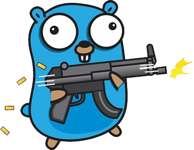

[Singpore-gopher](http://singapore-gopher.github.io) is a community of programmers and hobbyists who use Go in Singapore.

### Who we are

Some of us are developers, some writes Go code in the weekend for fun. We even have Gophers who contributes back to *the source*: [creators of Go framework](https://github.com/astaxie/beego) and [book author](http://www.manning.com/chang/).

We come together to talk about technology, our love/hate relationships with Go and generally, have a good time.

**Catch us on:**

<a href="https://www.facebook.com/groups/golang.sg/"><i class="fa fa-facebook fa-lg fa-fw"></i> Our facebook group</a> |
<a href="http://www.meetup.com/golangsg"><i class="fa fa-calendar fa-lg fa-fw"></i> Meetup page</a> |
<a href="https://twitter.com/golangSG"><i class="fa fa-twitter fa-lg fa-fw"></i> Twitter</a> |

****

## Upcoming

We have a meetup coming up this April:

### Working with JSON in Golang
*by Zoltan Giber*

Learn how to address certain gotchas when working with JSON, LIVE with Zoltan Giber. Bring your laptop to code, cuz you may even win some prizes.

### A short intro to Golang GC
*by Mark, Software Engineer at Viki*

A short intro about Go Garbarge Collector and why it matters at scale.

### T.B.A
And one more entertaining talk

### Catch us

    Where:    Viki (Block 59 Mohamed Sultan Road, #04-08)
    When:     Apr 14th, 7:00 PM (SGT) 

****

{:height="100px"}

[Powered by Solo - a Jekyll Theme](http://solo.chibi.io/)
